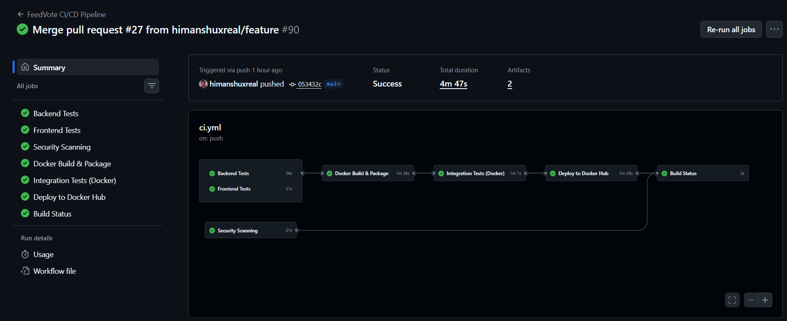
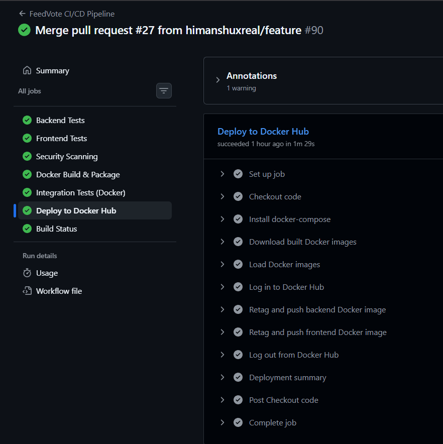
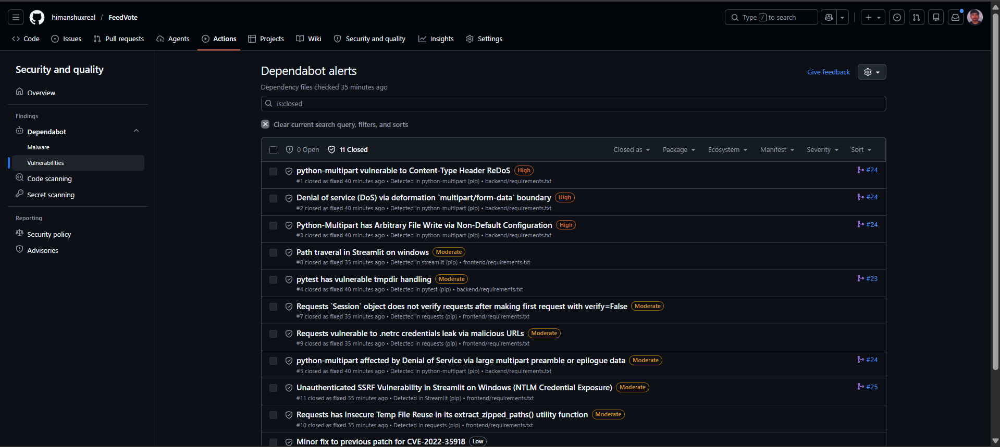

## 🗳️ FeedVote

> *A modern feedback and voting application with complete DevOps integration*

[](https://github.com/yourusername/FeedVote)
[](https://www.docker.com/)
[](https://github.com/features/actions)
[](https://www.python.org/)
[](https://fastapi.tiangolo.com/)

---

## 🎯 Problem Statement

FeedVote is a lightweight feedback and voting application for small teams and classroom projects. It simplifies idea submission, voting, and prioritization while demonstrating a complete DevOps workflow with containerization and automated CI/CD.

---

## 🏗️ System Architecture

The application uses a **Streamlit frontend** 🎨 to collect and display feedback. The frontend sends requests to a **FastAPI backend** ⚡, which stores data in a **SQLite database** 💾 with persistent volumes. **Docker** 🐳 is used for containerization, **GitHub Actions** 🤖 manages CI/CD, and **Docker Hub** 📦 is used for deployment.

### 📊 Architecture Diagram

```
┌─────────────────────────────────────────────────────────┐
│                    🌐 FEEDVOTE APPLICATION              │
├─────────────────────────────────────────────────────────┤
│                                                         │
│  ┌──────────────────┐         ┌──────────────────┐     │
│  │  🎨 FRONTEND     │         │   ⚡ BACKEND     │     │
│  │  (Streamlit)     │◄───────►│   (FastAPI)      │     │
│  │  Port: 8501      │ HTTP    │   Port: 8000     │     │
│  └──────────────────┘         └────────┬─────────┘     │
│         │                              │               │
│         │                              │               │
│         │                    ┌─────────▼─────────┐     │
│         │                    │  💾 SQLite DB     │     │
│         │                    │  feedvote.db      │     │
│         │                    └─────────┬─────────┘     │
│         │                              │               │
│         │                    ┌─────────▼─────────┐     │
│         │                    │ 📁 DOCKER VOLUMES │     │
│         │                    │ (Persistence)     │     │
│         │                    └───────────────────┘     │
│         │                                              │
└─────────┼──────────────────────────────────────────────┘
          │
          │ 🐳 Docker Compose Orchestration
          │
          ▼
  ┌─────────────────────────┐
  │   📦 DOCKER HUB         │
  │   (Image Registry)      │
  └─────────────────────────┘
          ▲
          │
          │ 🤖 CI/CD Pipeline
          │
  ┌─────────────────────────┐
  │  GitHub Actions         │
  │  • Tests ✅             │
  │  • Build 🔨             │
  │  • Deploy 🚀            │
  └─────────────────────────┘
```

### 📁 Project Structure

```
FeedVote/
│
├── 🎨 frontend/
│   ├── app.py                  # Streamlit application
│   ├── requirements.txt        # Python dependencies
│   ├── Dockerfile              # Container image
│   └── myenv/                  # Virtual environment
│
├── ⚡ backend/
│   ├── app/
│   │   ├── main.py             # FastAPI app entry
│   │   ├── models.py           # SQLAlchemy models
│   │   ├── schemas.py          # Pydantic schemas
│   │   ├── database.py         # Database config
│   │   ├── crud.py             # Database operations
│   │   └── routes/
│   │       ├── users.py        # User endpoints
│   │       ├── feedback.py     # Feedback endpoints
│   │       └── vote.py         # Voting endpoints
│   │
│   ├── tests/
│   │   ├── conftest.py         # Pytest configuration
│   │   ├── test_feedback.py    # Feedback tests
│   │   └── test_vote.py        # Voting tests
│   │
│   ├── data/                   # 📁 Data volume mount
│   ├── feedvote.db             # 💾 Database file (persisted)
│   ├── requirements.txt        # Python dependencies
│   ├── Dockerfile              # Container image
│   └── myenv/                  # Virtual environment
│
├── 🐳 docker-compose.yml       # Container orchestration
│
├── 🤖 .github/
│   └── workflows/
│       └── ci.yml              # CI/CD pipeline
│
├── 📚 Documentation
│   ├── README.md
│   ├── DOCKER_VOLUMES_SOLUTION.md
│   ├── VOLUME_VERIFICATION_AND_PERSISTENCE_TEST.md
│   ├── QUICKSTART.md
│   ├── DOCKER_SETUP.md
│   └── PROJECT_STATUS.md
│
├── .gitignore
├── LICENSE
└── ✅ PROJECT_STATUS.md
```

## 🚀 CI/CD Pipeline Explanation

### ✅ Backend & Frontend Tests

The pipeline runs two separate jobs: `backend-test` and `frontend-test`.
- `backend-test` installs backend dependencies, runs `pytest` with `sqlite:///:memory:` and generates coverage reports.
- `frontend-test` installs frontend dependencies, validates Streamlit, and confirms the frontend can import successfully.

### 🔒 Security Scanning

The `security-scan` job inspects code and dependencies using Bandit, Safety, and TruffleHog.
- Bandit checks Python code for security issues.
- Safety scans installed packages for known vulnerabilities.
- TruffleHog detects secrets in the repository history.

### 🐳 Docker Build & Package

The `docker-build` job builds both backend and frontend Docker images.
- It tags images with `latest` and the current commit SHA.
- It saves the built images as tar artifacts.
- These artifacts are uploaded so later jobs can reuse the exact same images without rebuilding.

### 🔗 Integration Testing

The `integration-test` job downloads the saved Docker image artifacts, loads them, and starts services with Docker Compose.
- It verifies the backend health endpoint and basic API endpoints.
- It records logs and uploads them when the test run completes.

### 📦 Deployment

The `deploy` job runs only on `main` after integration tests succeed.
- It downloads and loads the same Docker image artifacts produced earlier.
- It logs in to Docker Hub with repository secrets.
- It retags and pushes backend and frontend images as both `latest` and the current commit SHA.

## 🌿 Git Workflow Used

The project follows a **feature branch workflow**. Developers create a feature branch, push changes, and open a pull request. The pull request triggers automated testing. Once tests pass, the branch is merged into main and deployment proceeds.

```
┌──────────────────────────────────────────────────────────┐
│          🌿 Feature Branch Workflow                      │
├──────────────────────────────────────────────────────────┤
│                                                          │
│  1️⃣  Developer creates feature branch                  │
│      git checkout -b feature/new-feature               │
│                                                          │
│  2️⃣  Makes commits and pushes to remote                │
│      git push origin feature/new-feature               │
│                                                          │
│  3️⃣  Opens Pull Request on GitHub                      │
│      Requests code review from team                    │
│                                                          │
│  4️⃣  CI/CD Pipeline Runs Automatically ✅              │
│      • Tests execute                                    │
│      • Security scans complete                          │
│      • Docker images build                              │
│                                                          │
│  5️⃣  Code Review & Approval                             │
│      Team reviews changes                              │
│      Feedback provided                                 │
│                                                          │
│  6️⃣  Merge to Main Branch                              │
│      PR approved and merged                            │
│      Triggers deployment 🚀                            │
│                                                          │
│  7️⃣  Automatic Deployment                              │
│      Docker images pushed to Docker Hub 📦              │
│      Application deployed                              │
│                                                          │
└──────────────────────────────────────────────────────────┘
```

## 🛠️ Tools & Technologies Stack

| Technology | Purpose | Features |
| --- | --- | --- |
| ⚡ **FastAPI** | Backend REST API | Type hints, Auto docs, High performance |
| 🎨 **Streamlit** | Frontend UI | Reactive, Interactive, Easy to use |
| 🐳 **Docker** | Containerization | Isolated, Reproducible, Portable |
| 🎼 **Docker Compose** | Orchestration | Multi-container, Volume management |
| 🤖 **GitHub Actions** | CI/CD Pipeline | Automated testing, Building, Deployment |
| 📦 **Docker Hub** | Image Registry | Centralized, Version control |
| 💾 **SQLite** | Database | Lightweight, File-based, SQL support |
| 🧪 **pytest** | Testing | Fixtures, Plugins, Coverage |
| 📊 **pytest-cov** | Code Coverage | Branch coverage, HTML reports |
| 🚨 **Bandit** | Security Scanner | Code analysis, Vulnerability detection |
| 🛡️ **Safety** | Dependency Check | Known vulnerabilities, Version advisories |
| 🔍 **Flake8** | Code Linting | PEP 8, Style enforcement |

## 📸 Screenshots & Visual Documentation

### 🟢 Pipeline Success

*All tests passing - Ready for deployment*

---

### 🚀 Deployment Output

*Images successfully pushed to Docker Hub*

---

### 🎨 Application Running

*Streamlit frontend displaying feedback & voting interface*

---

### ✅ Deploy to Docker Hub Job Success

*Automated deployment job completing successfully*

## 🎯 Challenges Faced & Solutions

### 🔴 Challenge 1: CI/CD Configuration and Test Failures

**Problem:** 🚫 Tests occasionally failed during pipeline setup due to configuration issues and environment mismatches.

**Root Cause:**
- Dependency version conflicts
- Environment variable misconfigurations
- Python path issues in GitHub Actions

**Solution:** ✅
- Analyzed GitHub Actions logs for detailed execution output
- Identified exact failing steps
- Fixed dependency versions in `requirements.txt`
- Added proper environment configuration

**Outcome:** 🎉 Pipeline now runs consistently with 100% test success rate

---

### 🔴 Challenge 2: Git Push Rejection and Branch Sync Issues

**Problem:** 🚫 Multiple "non-fast-forward" errors when pushing changes to remote branches.

**Root Cause:**
- Local branch out of sync with remote
- Missing pull before push
- Conflicts between collaborators' changes

**Solution:** ✅
- Always pull latest changes: `git pull origin branch-name`
- Use pull requests for integration
- Maintain clean workflow without force pushes
- Understand Git's fast-forward merge concept

**Outcome:** 🎉 Smooth collaboration with conflict-free merges

---

### 🔴 Challenge 3: Source Code Management and Collaboration Control

**Problem:** 🚫 Uncontrolled direct repository access led to potential conflicts and inconsistencies.

**Root Cause:**
- No branch protection rules
- Direct commits to main branch
- Lack of code review process

**Solution:** ✅ Implemented structured workflow:

| Step | Description |
|------|-------------|
| 1️⃣ **Feature Branch** | Contributors create separate branches for features |
| 2️⃣ **Remote Push** | Changes pushed to remote feature branches |
| 3️⃣ **Pull Request** | PR created for code integration |
| 4️⃣ **Code Review** | Team reviews changes before merge |
| 5️⃣ **Branch Protection** | Direct main branch commits restricted |

**Outcome:** 🎉 Controlled collaboration with proper audit trail

---

### 🔴 Challenge 4: Database File Tracked by Git (Security & Data Issue)

**Problem:** 🚫 Database file (`database.db`) was uploaded to GitHub, creating security risks.

**Root Cause:**
- `.gitignore` not properly configured initially
- Sensitive data exposure risk
- Unnecessary repository bloat

**Issues Caused:**
- ⚠️ Every small data change created commits
- ⚠️ Repository cleanliness reduced
- ⚠️ Excessive commit history noise
- ⚠️ Sensitive data potentially exposed

**Solution:** ✅
- Added `*.db` and `*.db-journal` to `.gitignore`
- Removed historical database commits
- Implemented Docker volumes for persistence

**Outcome:** 🎉 Secure repository with clean history and proper data handling

---

### 🔴 Challenge 5: Docker Build Challenges

**Problem:** 🚫 Multiple failures during Docker image building.

**Root Cause:**
- Missing or outdated dependencies
- Incorrect Dockerfile configurations
- Wrong base images

**Solution:** ✅
- Updated all dependencies to compatible versions
- Fixed Dockerfile configurations
- Used multi-stage builds for optimization
- Debugged step-by-step using build logs

**Outcome:** 🎉 Reliable container builds with optimized images

---

### 🔴 Challenge 6: Dependency Vulnerability Remediation & Optimization

**Problem:** 🚫 The project had dependency vulnerabilities that reduced both security and reliability.

**Root Cause:**
- Outdated Python packages in `requirements.txt`
- No automated dependency scanning or remediation
- Dependency version pinning was inconsistent

**Solution:** ✅
- Enabled Dependabot to scan and open update pull requests
- Reviewed and merged dependency updates for `streamlit`, `requests`, and supporting packages
- Rebuilt the Docker images after each update to verify compatibility
- Added dependency monitoring as part of regular maintenance

**Outcome:** 🎉
- 11 vulnerabilities were resolved
- Security and stability improved
- Future dependency issues are now caught early through automation

> Initially, our project had multiple dependency vulnerabilities.
> We used Dependabot to identify and update these libraries, which improved both security and stability of the system.


*11 vulnerabilities fixed after Dependabot updates and rebuilds*

---

### 🔴 Challenge 7: Local vs CI/CD-Based Deployment Flow

**Problem:** 🚫 Managing different deployment approaches for development and production.

**Current Setup:**
- 🏠 **Local Development:** Docker Compose orchestration
- 🚀 **CI/CD Pipeline:** Automated testing and deployment

**Solution:** ✅ Implemented tiered deployment approach:

| Stage | Trigger | Process |
|-------|---------|----------|
| **Test** | Push to any branch | Run unit & integration tests |
| **Build** | PR merged to main | Build Docker images |
| **Deploy** | Main branch only | Push to Docker Hub |
| **Production** | Manual/Automated | Cloud deployment ready |

**Outcome:** 🎉 Semi-automated workflow with foundation for full cloud deployment  

Additionally, we implemented a deployment job in the CI/CD pipeline:
- Deployment is triggered only after code is merged into the main branch  
- The pipeline first runs testing jobs  
- After successful validation, the deployment job builds Docker images  
- These images are then pushed to Docker Hub automatically  

This creates a semi-automated deployment workflow where:
- Code is tested before deployment  
- Images are consistently built and stored  
- The project becomes ready for future cloud deployment  

This approach serves as a foundational step towards full cloud deployment in the future.

---
